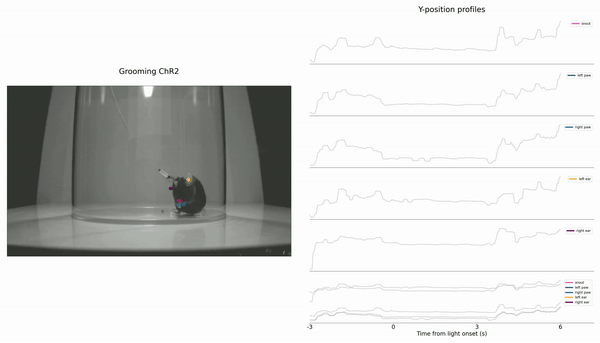
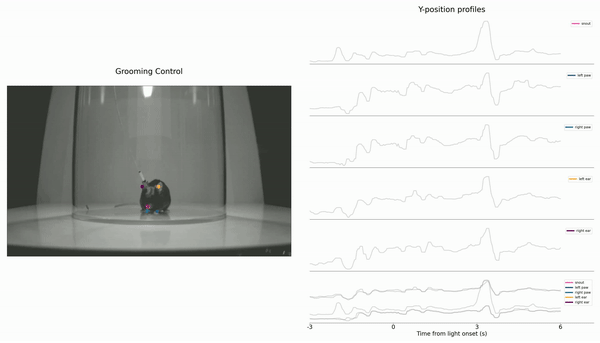
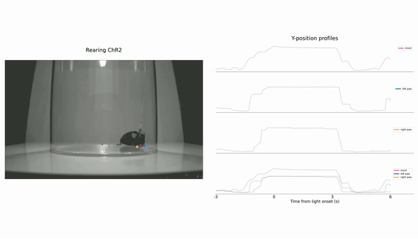
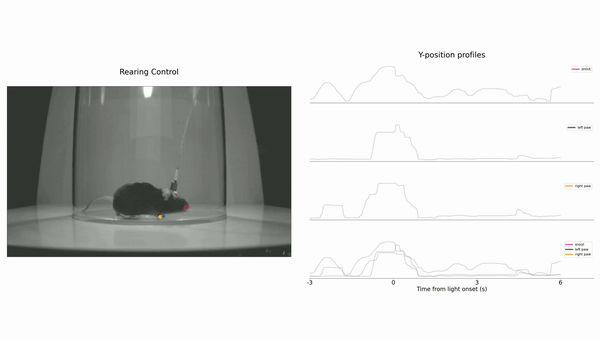

# Pause-And-Play
Source code for the upcoming Nature Neuroscience paper entitled "Pedunculopontine neurons for global motor arrest", Goñi-Erro et al. 2023

**Chr2 Grooming behaviour**

### Abstract
Arrest of ongoing movements is an integral part of executing motor programs. The behavioral arrest may happen upon termination of a goal directed movement or as a global motor arrest either in the context of fear or in response to salient environmental cues. The neuronal circuits that bridge with the executive motor circuits to implement a global motor arrest are poorly understood. Here, we report the discovery that glutamatergic Chx10-derived neurons in the rostral pedunculopontine nucleus (PPN) in mice arrest all ongoing movements while simultaneously causing apnea and bradycardia. This global motor arrest has a “pause-and-play” pattern with an instantaneous interruption of movement followed by a short-latency continuation from where it was paused. Mice naturally perform arrest bouts with the same combination of motor and autonomic features. The Chx10-PPN evoked arrest is different to ventrolateral periaqueductal gray induced freezing. Our study defines a motor command that induces a global motor arrest which may be recruited in  response to salient environmental cues to allow for a preparatory or arousal state, and identifies a locomotor-opposing role for rostrally-biased glutamatergic neurons in the PPN.

### Additional Media

**Control Grooming behaviour**

**Chr2 Rearing behaviour**

**Control Rearing behaviour**

